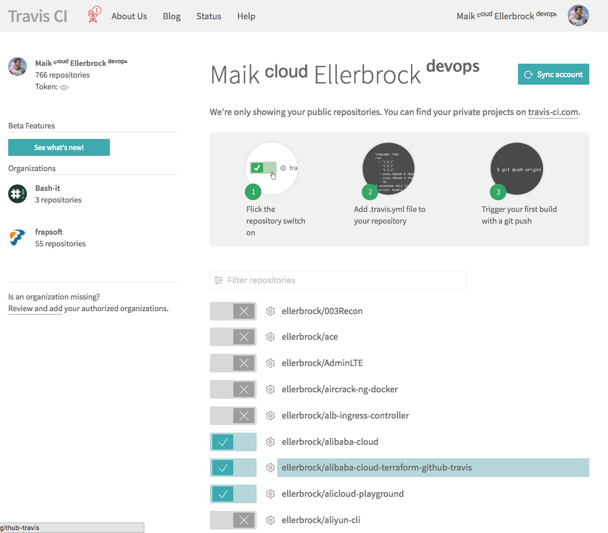
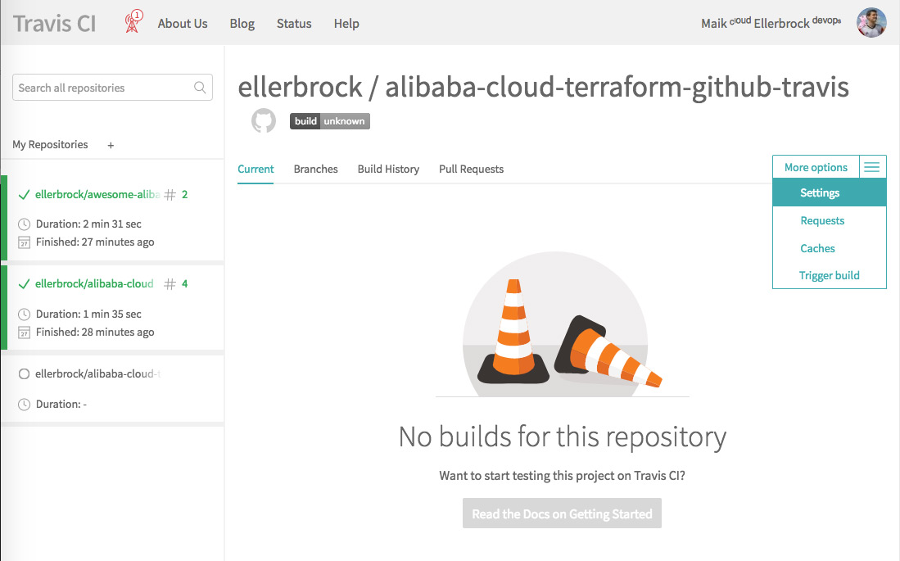

# Alibaba Cloud Infrastructure as Code Quickstart [](https://github.com/ellerbrock/open-source-badges/) [](https://gitter.im/frapsoft/frapsoft/) [](https://opensource.org/licenses/mit-license.php)


## What you need

- [Github Account](https://github.com/join)
- [Travis Account](https://travis-ci.org/) for Continuous Integration and Delivery
- [Terraform](https://www.terraform.io/) installed for local testing

## Remote Storage

A first draft from a working but not yet production ready version you can find here: <https://github.com/ellerbrock/terraform-consul-backend>

In this setup we could make a initial bootstraping of the account, setup a Consul Cluster and then import the Remote State to there, even with locking support.


## Configuration

### 1.) Activate Travis for the Repository



### 2.) Go to Travis Repository Settings



Under General i have my Settings that:

- ON: Building only if .travis.yml is present
- ON: Build branch updates
- ON: Limit concurrent jobs? 1
- OFF: Build pull request updates

### 3.) Add your Credentials to Environment Variables


The Terraform Alicloud Provider Plugin expect the Environment Variables named like these:

- `ALICLOUD_ACCESS_KEY="your-key-here"`
- `ALICLOUD_SECRET_KEY="your-secret-here"`
- `ALICLOUD_REGION="your-region"`

Ensure to disable the  `Display value in build log` 

You can read in more detail about this [here](https://www.terraform.io/docs/providers/alicloud/index.html#argument-reference).

### 4.) Add `.travis.yml` to your Repo

For a clean and isolated work i choose the [Docker service](https://docs.travis-ci.com/user/docker/) for Travis CI.
We run `terraform` with the official lightweight Alpine Linux Image [hashicorp/terraform:light](https://hub.docker.com/r/hashicorp/terraform/) for the provisioning.

Ensure to have all your commands which needs access to the encrypted environment variables from travis in the `before_script`, for whatever weird reason after you can't access them anymore e.g. via `script`. I hope this get's updated in the future.


```yml
sudo: required

language: bash

dist: trusty

group: deprecated-2017Q4

services:
  - docker

cache:
  directories:
    - ".terraform"

env:
  - TRAVIS_SECURE_ENV_VARS=true

before_script:
  - docker pull hashicorp/terraform:light
  - docker run -e "ALICLOUD_ACCESS_KEY=${ALICLOUD_ACCESS_KEY}" -e "ALICLOUD_SECRET_KEY=${ALICLOUD_SECRET_KEY}" -e "ALICLOUD_REGION=${ALICLOUD_REGION}" -v $(pwd):/x/ -w /x/ hashicorp/terraform:light init
  - docker run -e "ALICLOUD_ACCESS_KEY=${ALICLOUD_ACCESS_KEY}" -e "ALICLOUD_SECRET_KEY=${ALICLOUD_SECRET_KEY}" -e "ALICLOUD_REGION=${ALICLOUD_REGION}" -v $(pwd):/x/ -w /x/ hashicorp/terraform:light validate
  - docker run -e "ALICLOUD_ACCESS_KEY=${ALICLOUD_ACCESS_KEY}" -e "ALICLOUD_SECRET_KEY=${ALICLOUD_SECRET_KEY}" -e "ALICLOUD_REGION=${ALICLOUD_REGION}" -v $(pwd):/x/ -w /x/ hashicorp/terraform:light plan
  - docker run -e "ALICLOUD_ACCESS_KEY=${ALICLOUD_ACCESS_KEY}" -e "ALICLOUD_SECRET_KEY=${ALICLOUD_SECRET_KEY}" -e "ALICLOUD_REGION=${ALICLOUD_REGION}" -v $(pwd):/x/ -w /x/ hashicorp/terraform:light apply -auto-approve

notifications:
  email:
    on_success: never
    on_failure: always
```

### 5.) Add your Terraform Code

In this example i create for the test a VPC.

`main.tf`

```
# Terraform Provider Alicloud expects these Variables:
#
# ALICLOUD_ACCESS_KEY
# ALICLOUD_SECRET_KEY
# ALICLOUD_REGION
#
# Store them as environment variables in Travis for the Repository.

provider "alicloud" {
  access_key = "${var.access_key}"
  secret_key = "${var.secret_key}"
  region     = "${var.region}"
}

resource "alicloud_vpc" "vpc" {
  name       = "${var.vpc_name}"
  cidr_block = "${var.vpc_cidr_block}"
}
```
`variables.tf`

```
~/d/c/a/alibaba-cloud-terraform-github-travis ❯❯❯ cat variables.tf.old
variable "access_key" {
  description = "aws access key"
  default     = ""
}

variable "secret_key" {
  description = "aws secret key"
  default     = ""
}

variable "region" {
  description = "default region"
  default     = "eu-central-1"
}

variable "vpc_name" {
  description = "vpc name"
  default     = "default"
}

variable "vpc_cidr_block" {
  description = "default vpc cidr"
  default     = "192.168.0.0/16"
}
```

## Links

- [Terraform Alicloud Provider Docs](https://www.terraform.io/docs/providers/alicloud/index.html)
- [Terraform Registry for Alicloud](https://registry.terraform.io/browse?provider=alicloud)

#### Alicloud Terraform Examples
 
- <https://github.com/terraform-providers/terraform-provider-alicloud/>
- <https://github.com/alibaba/terraform-provider/tree/master/terraform/examples>


## Support

You can get direct support for my Open Source projects on Alibaba Cloud here

[](https://gitter.im/alibabacloudnews/Lobby)


## Try Alibaba Cloud

[Sign up](http://ow.ly/YKQe30hHgp8) today and get $300 valid for the first 60 days to try Alibaba Cloud.


## Contact

[](https://github.com/ellerbrock/)[](https://hub.docker.com/u/ellerbrock/)[](https://www.npmjs.com/~ellerbrock)[](https://twitter.com/frapsoft/)[](https://www.facebook.com/frapsoft/)[](https://plus.google.com/116540931335841862774)[](https://gitter.im/frapsoft/frapsoft/)

## License 

[](https://opensource.org/licenses/mit-license.php)

This work by <a xmlns:cc="http://creativecommons.org/ns#" href="https://github.com/ellerbrock" property="cc:attributionName" rel="cc:attributionURL">Maik Ellerbrock</a> is licensed under a <a rel="license" href="https://creativecommons.org/licenses/by/4.0/">Creative Commons Attribution 4.0 International License</a> and the underlying source code is licensed under the <a rel="license" href="https://opensource.org/licenses/mit-license.php">MIT license</a>.
